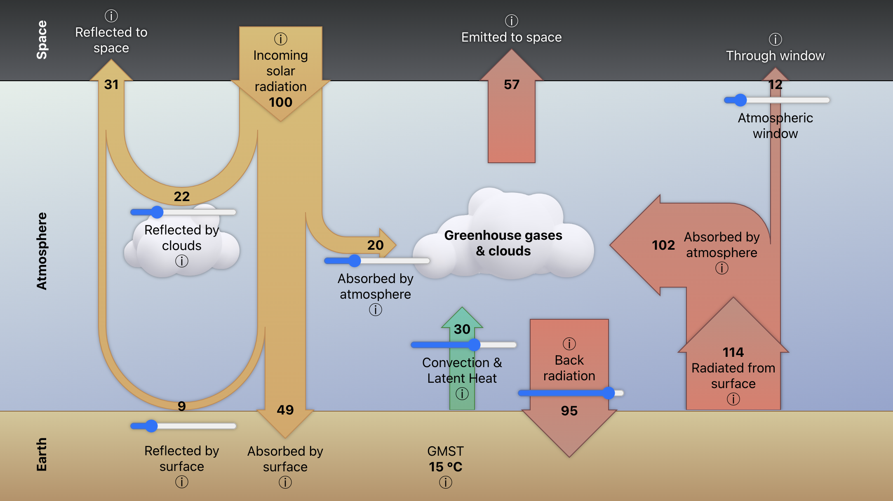

# Climate Explorer

## Introduction

Hosted at [craigwalton.github.io/ClimateExplorer](https://craigwalton.github.io/ClimateExplorer).

Explore Earth's climate's energy budget.

This ReactJS app provides an overview of Earth's climate systems, including albedo and the greenhouse effect.
Users can dynamically adjust parameters and observe the corresponding changes to Earth's Global Mean Surface Temperature
(GMST), gaining insights into the interactions that shape our climate.

My understanding of this basic climate model is from the Open
University's [OpenLearn Climate Change](https://www.open.edu/openlearn/nature-environment/climate-change/) course. The
infographic is inspired from course materials.

## Development

### `npm start`

Runs the app in the development mode.\
Open [http://localhost:3000](http://localhost:3000) to view it in your browser.

### `npm run deploy`

Deploy to GitHub Pages.

https://craigwalton.github.io/ClimateExplorer

## License

This software project is licensed under the terms of the MIT license.

The cloud graphics in `public/graphics` are licensed
by [Freepik](https://www.freepik.com/free-vector/collection-3d-white-clouds-isolated-white_20111680.htm).
